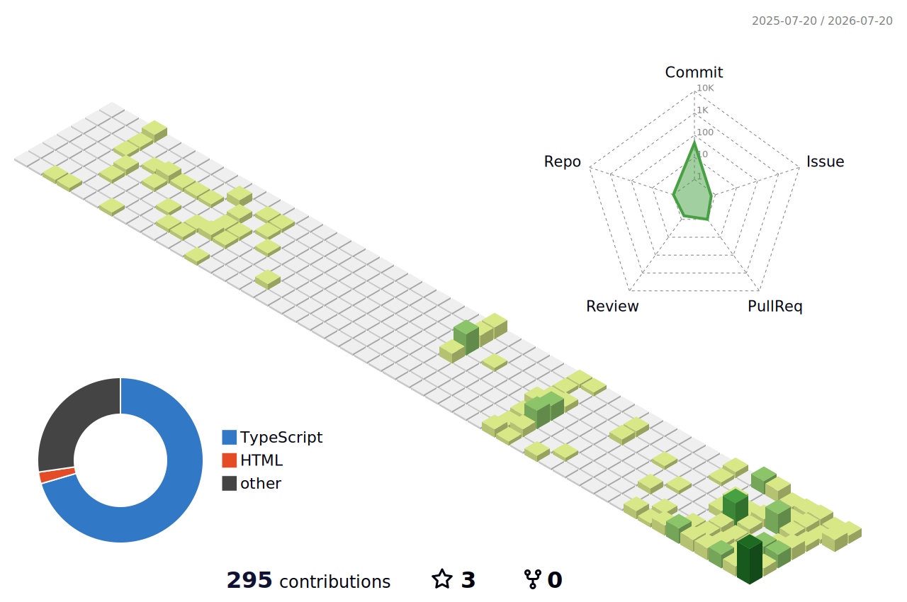

<div align="center">

<h1 align="center">
  
</h1>
<p align="center">
  
  
</p>



</div>

<br/>

<table align="center">
  <tr>
    <td width="50%" valign="top">

### 🌱 About Me

Currently leveling up as a **Fullstack Developer**, with 3+ years of hands-on experience in the React ecosystem.

When I'm away from the keyboard, you'll find me running or swimming 🏊‍♀️🏃‍♀️.

**Get in touch:**
📫 [nguyenxuananhuong541@gmail.com](mailto:nguyenxuananhuong541@gmail.com)

  </td>
  <td width="50%" valign="top">

### 🧠 Skills Snapshot

```javascript
const skills = {
  frontend: ['React', 'Svelte', 'TypeScript'],
  backend: ['Node.js', 'ExpressJS'],
  framework: ['Next.js', 'NestJS'],
  database: ['MySQL', 'Firebase', 'PostgreSQL'],
  tools: ['Git', 'Docker', 'ChatGPT', 'Cursor']
};
```

</td>
</tr>
</table>

<p align="center">
  
</p>

<table align="center">
  <tr>
    <td align="center" width="18%">
      <b>Languages</b>
    </td>
    <td width="82%">
      
      
      
      
    </td>
  </tr>
  <tr>
    <td align="center"><b>Frontend</b></td>
    <td>
      
      
      
      
      
      
    </td>
  </tr>
  <tr>
    <td align="center">
      <b>Backend</b>
    </td>
    <td>
      
      
    </td>
  </tr>
  <tr>
    <td align="center">
      <b>Tools</b>
    </td>
    <td>
      
      
      
      
    </td>
  </tr>
</table>

<p align="center">
  
</p>

<div align="center">
  
<br/>

[](https://github.com/anhuong541/github-readme-activity-graph)

</div>

<div align="center">
  <sub>Thanks for visiting my profile! ⭐</sub>
</div>
